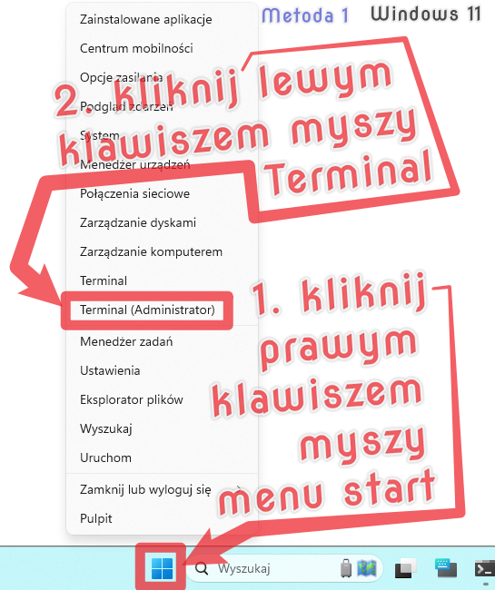
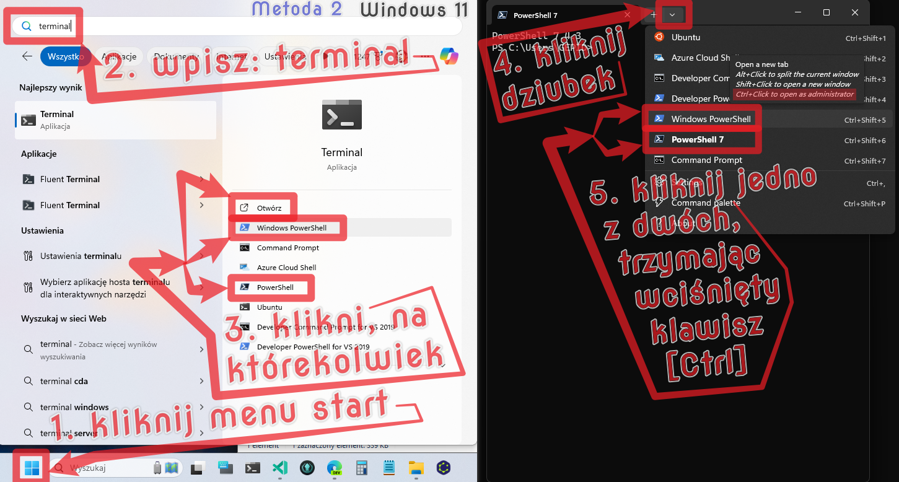
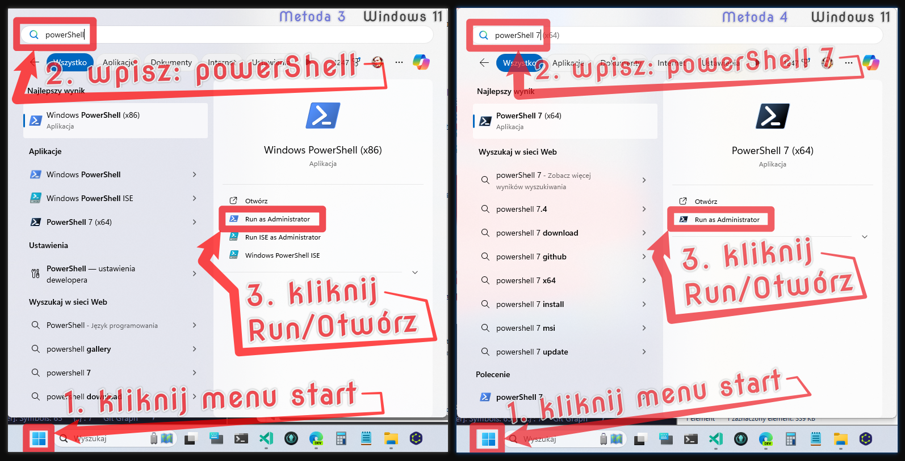

# DeNo (/diːnoʊ/) - co to?

DeNo to niezbędne [**środowisko uruchomieniowe** (wiki-en)](https://en.wikipedia.org/wiki/Runtime_system) dla programu **skanoteka-pobieracz** można je zainstalować: na **Windows**, na MacOS, na Linux.

- [**Oficjalna strona DeNo** (https://deno.com/)](https://deno.com/) na której można zapoznać się z szczegółami.
- [**Oficjalna strona repozytorium DeNo** (https://github.com/denoland/deno)](https://github.com/denoland/deno) na której można zapoznać się z kodem źródłowym programu **DeNo** .

DeNo ([/ˈdiːnoʊ/](http://ipa-reader.xyz/?text=%CB%88di%CB%90no%CA%8A), pronounced
`dee-no`) to [**środowisko uruchomieniowe** (wiki-en)](https://en.wikipedia.org/wiki/Runtime_system) dla [**JavaScript** (wiki-en)](https://en.wikipedia.org/wiki/JavaScript), [**TypeScript** (wiki-en)](https://en.wikipedia.org/wiki/TypeScript) i [**WebAssembly** (wiki-en)](https://en.wikipedia.org/wiki/WebAssembly), które jest oparte na [**silniku JavaScript V8** (wiki-en)](https://en.wikipedia.org/wiki/V8_(JavaScript_engine)) i języku programowania [**Rust** (wiki-en)](https://en.wikipedia.org/wiki/Rust_(programming_language)) oraz [**Tokio** (wiki-en)](https://en.wikipedia.org/wiki/Tokio_(software)). [**DeNo** (wiki-en)](https://en.wikipedia.org/wiki/Deno_(software)) współtworzył [**Ryana Dahla** (wiki-en)](https://en.wikipedia.org/wiki/Ryan_Dahl), który stworzył również Node.js.

## Instalacja DeNo na Windows

Na Windows można zainstalować Deno na 2 sposoby: albo przez wbudowany w każdy system (**Terminal** / **Konsole**) **PowerShell**, *albo za pomocą menadżera pakietów [Chocolatey](https://chocolatey.org/packages/deno) - który nie jest wbudowany w system (wymaga dodatkowej instalacji)*

### PowerShell (Windows)

W pierwszej kolejności należy otworzyć (**terminal** / **konsole**) **PowerShell** na swoim komputerze, a następnie wkleić lub wpisać poniższą linijkę kodu i nacisnąć enter.

```powershell
irm https://deno.land/install.ps1 | iex
```

Istnieją co najmniej 4 metody, na otwarcie (**terminala** / **konsoli**) **PowerShell** poniżej na 3 ilustracjach przedstawiam te 4 metody na uruchomienie **PowerShell** krokpo kroku.

---



---



---



---

### Alternatywną metodą jest użycie menazera pakietów [Chocolatey](https://chocolatey.org/packages/deno) (Windows)

```powershell
choco install deno
```

## Instalacja DeNo na MacOs

### Shell (Mac)

```sh
curl -fsSL https://deno.land/install.sh | sh
```

### Menadżer pakietów [Homebrew](https://formulae.brew.sh/formula/deno) (Mac)

```sh
brew install deno
```

## Instalacja DeNo na Linux

### Shell / Bash (Linux)

```sh
curl -fsSL https://deno.land/install.sh | sh
```

---

...
